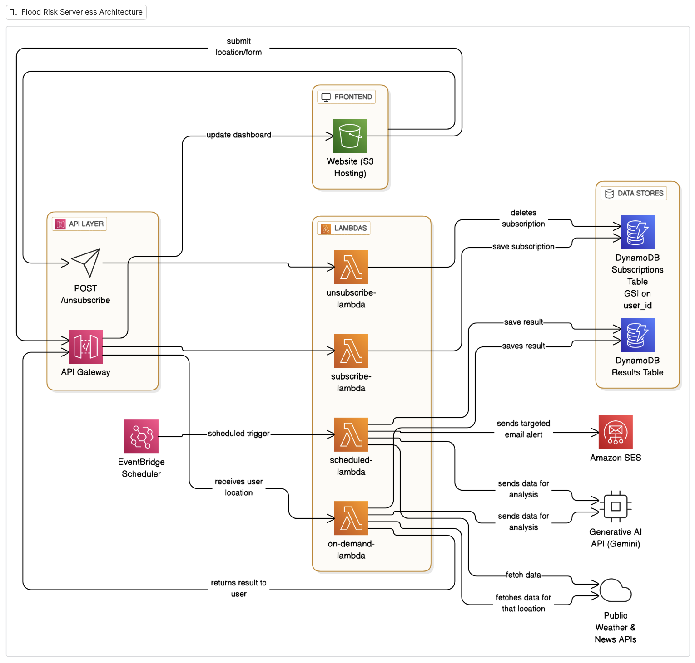

# 🌊 Flood Risk Predictor

A serverless, AI-powered application built on AWS that provides real-time flood risk analysis and sends targeted alerts to subscribed users.

---

## 🛑 The Problem

Flooding is one of the most common and costly natural disasters, but specific, real-time risk information is often hard for individuals to access. The **business problem** this project solves is the lack of a simple, personalized, and proactive tool that allows residents to understand their immediate flood risk and receive timely warnings for their specific locations of interest, such as their home or workplace.

---

## ☁️ Why Serverless?

A serverless architecture, with AWS Lambda at its core, was chosen for several key reasons that are perfectly suited to this problem:

- **Cost-Effectiveness**: With a pay-per-use model, we only pay for the compute time we actually consume. For an application with unpredictable traffic (heavy during weather events, light otherwise), this avoids the cost of running idle servers.

- **Automatic Scalability**: During a major weather event, thousands of users might request analysis simultaneously. AWS Lambda automatically scales to meet this demand without any manual intervention, ensuring the application remains responsive when it's needed most.

- **Focus on Logic**: Instead of managing servers, patching operating systems, or configuring infrastructure, we can focus entirely on the core application logic—ingesting data, analyzing risk with AI, and notifying users.

## 👨‍⚖️ Note for Hackathon Judges

**Reasoning:** This application uses **Amazon SES**, which is currently in a "sandbox" environment for security purposes. In this mode, alerts can only be sent to manually verified email addresses. I have explained clearly in the working demo how the entire process works.

---

## 🏛️ Architecture

The application is built on a **100% serverless architecture on AWS** to ensure scalability, reliability, and cost-effectiveness.

---

## ⚡ How AWS Lambda is Triggered

This project uses multiple Lambda triggers to create an event-driven system:

- **API Gateway (HTTP Requests):**
  - `POST /analyze` → `on-demand-lambda`
  - `POST /subscribe-lambda` → `subscribe-lambda`
  - `POST /unsubscribe` → `unsubscribe-lambda`

- **EventBridge Scheduler (Scheduled Events):**
  - `scheduled-lambda` is triggered daily to perform automated risk assessments and send notifications without any user interaction.

---

## ✨ Key Features

- **On-Demand Analysis**: Users can enter any city to get an immediate flood risk assessment powered by a Generative AI model.

- **Subscription Alerts**: Users can subscribe to receive proactive email alerts for specific locations.

- **Targeted Notifications**: The backend uses Amazon SES to send beautifully formatted HTML emails only to users subscribed to a high-risk location.

- **Automated & Scheduled**: An EventBridge schedule triggers a daily risk assessment for all subscribed locations, ensuring timely alerts.

- **Unsubscribe**: A simple, one-click feature allows users to unsubscribe from all alerts.

---

## 🛠️ Technology Stack

- **AWS Lambda**: Core compute for all backend logic.
- **Amazon API Gateway**: Exposes the backend logic as a public REST API for the frontend.
- **Amazon S3**: Hosts the static frontend website.
- **Amazon DynamoDB**: NoSQL database for storing user subscriptions and analysis results.
- **Amazon SES**: Sends targeted, high-quality HTML email alerts.
- **Amazon EventBridge Scheduler**: Triggers the scheduled risk analysis function.
- **Frontend**: HTML, CSS, vanilla JavaScript.
- **AI Model**: Gemini API for natural language-based risk assessment.
- **External APIs**: OpenWeatherMap and NewsAPI for real-time data ingestion.

---

## ⚙️ Configuration

The application is configured via **environment variables** in the Lambda functions, which include:

- API keys for:
  - Gemini API
  - OpenWeatherMap
  - NewsAPI

- DynamoDB table names

- Verified "From" email address for Amazon SES
